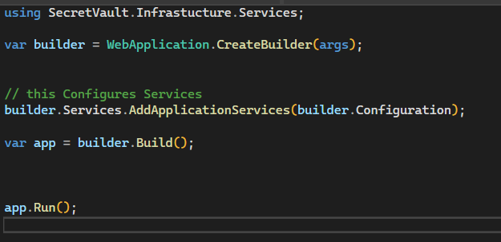
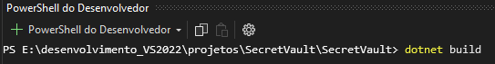

#PROJETO SECRETS VAULT MINIMAL API C#

## Tópicos

- [Introdução](#Introdução)

- [Arquitetura Onion](#arquitetura-onion)
 

## Introdução

Vamos criar um projeto em C# com a finalidade de armazenar segredos com logins e senha de bancos de dados, Keys, etc. Este projeto será uma minimal API com end point para gerenciar usuários e os segredos. Terá autenticação JWT, sendo necessário ter credencias para acessar a API.  Estas informações serão armazenadas em banco de dados Sqlite e a arquitetura será do tipo “ONION”. É um projeto simples mas completo e útil em muitas situações.

## Criando o projeto:

Crie um novo projeto do tipo: API Web do ASP.NET Core

Chame o projeto de  de SecretVault: 

Não usaremos controllers, docker, HTTPS ou swagger:

## Arquitetura Onion:  

A arquitetura Onion é uma abordagem para resolver os problemas de acoplamento e separação de responsabilidades encontrados na arquitetura tradicional em três camadas. Ela é visualmente representada como círculos concêntricos, similares a uma cebola cortada ao meio, onde cada camada representa um nível de abstração.
A divisão comum das camadas na arquitetura Onion é a seguinte: 
1.Domain: Esta é a camada mais central e não deve ter dependências de outras camadas externas. Ela contém a lógica de negócio e as entidades do domínio. 
2.Service/Application: Esta camada coordena a lógica de aplicação e usa as regras de negócios definidas no domínio. 
3.Infrastructure: Inclui a implementação de interfaces e os detalhes de acesso a dados, como repositórios e serviços externos. 
4.Presentation: Responsável pela interface do usuário e interações, sendo geralmente a camada mais externa. 

Um dos principais benefícios da arquitetura Onion é que ela promove o baixo acoplamento e a alta coesão. As dependências fluem de fora para dentro, significando que as camadas externas podem referenciar as camadas internas, mas não o contrário. Isso permite encapsular a lógica de negócio nas camadas de domínio e aplicação, mantendo-a isolada dos detalhes de implementação específicos da infraestrutura.
Além disso, as camadas externas (Infrastructure e Presentation) podem implementar interfaces definidas nas camadas internas, permitindo uma maior flexibilidade e testabilidade, pois a lógica de negócios pode ser testada independentemente dos detalhes de implementação.
Em resumo, a arquitetura Onion facilita a manutenção e a escalabilidade de sistemas complexos, promovendo boas práticas de design, como a inversão de dependência e a separação de responsabilidades.
Vamos com começar criando as entidades e a estrutura de dados. Neste projeto usaremos o ORM (Object-Relational Mappers) Entity Framework (EF).
A primeira coisa a fazer é Instalar os pacotes para o EF. Neste projeto o banco de dados é um Sqlite.

São:

Microsoft.EntityFrameworkCore.Sqlite - Fornece suporte ao banco de dados SQLite no Entity FrameWork Core.
Microsoft.EntityFrameworkCore.Design - Pacote necessário para executar comandos do EF que geram código. Será usado para criar as tabelas.
Microsoft.EntityFrameworkCore.Tools - Este pacote permite a execução de comandos EF Core no CLI (Command Line Interface) e no Package Manager Console do Visual Studio. Ele é utilizado para facilitar a criação, aplicação e gerenciamento de migrações de banco de dados e outras tarefas de manutenção do esquema do banco de dados.

Usando o EF podemos a partir das entidades criar o banco de dados.
Neste projeto simples teremos duas entidades  :
public class Secret
{
    public int Id { get; set; }
    public string Key { get; set; }
    public string EncryptedValue { get; set; }
}

e
 public class User
 {
     public int Id { get; set; }
     public string Username { get; set; }
     public String Password { get; set; }
     public string Role { get; set; } // "Admin" or "Operator"
 }

Na estrutura que criamos estas entidades fazem parte do Domínio (Domain)
SecretVault\Domain\Entities

Agora vamos criar o DbContext e DbSet

A classe responsável será SecretManagerContext.cs em SecretVault\Infrastructure\Data\Context

Esta classe herda de DbContext do EF que é responsável pela representação do banco em memória

O Construtor recebe as opções que são passadas para o construtor base da classe DBContext. Isto permite por exemplo informar qual é a conexão do banco de dados. 

DbSet<> são as representações das tabelas Secrets e Users permite as operações de CRUD Create (Criar), Read (Ler), Update (Atualizar) e Delete (Excluir) sobre estas entidades.

O método OnModelCreating  é uma ferramenta  para configurar e personalizar o comportamento do modelo de dados. Ele permite definir relacionamentos, configurações de propriedades, restrições e dados iniciais, tudo programaticamente, garantindo que o modelo de dados seja configurado corretamente antes que a aplicação comece a interagir com o banco de dados.  Ele está sobrescrevendo um método virtual definido na classe base DbContext.

modelBuilder.ApplyConfigurationsFromAssembly(Assembly.GetExecutingAssembly());
Informará as configurações das tabelas que serão criadas automaticamente, estas configurações estão nas  arquivos SecretMapping  e UserMapping.
 

Estes arquivos implentam a interface IEntityTypeConfiguration para cada modelo de dados definindo chave primaria, tipo de campo, se é requido etc
UserMapping.cs:

SecretMapping.cs:

Agora vamos definir a string de conexão com o local para o banco. Como estou usando o Sqlite. Não é necessário prévia instalação de um servidor de banco de dados. O Sqlite embraca com facilidade na aplicação.

A string de conexão é “Data Source=SecretVaultContext.db”

Como se trata de um banco local vamos definir a string de conexão em appSettings.json , se usássemos um banco em servidor com dados sensíveis como login e senha usaríamos para testes locais o user-secrets e variáveis de ambiente em produção por exemplo entre outras técnicas que existem.

No próximo passo precisamos registrar o DbContext. Ao invés de deixar no Program.cs por uma questão de organização vou deixar na camada infrastructure pois ela trata da configuração de dependência e serviços que suportam a aplicação mas não faz parte da lógica de negócios. Será uma classe estatica chamada ServiceConfiguration.

Também criamos uma classe Settings  que é responsável por armazenar configurações globais e valores constantes usados em várias partes do aplicativo. Ficará na camada  Infrastructure, pois é responsável por fornecer detalhes de configuração que são específicos do ambiente de execução e que suportam a aplicação, mas não fazem parte direta da lógica de negócios.

Nesta classe é registrado  as credencias do usuário master inicial para a criação do Banco de dados.

Para concluir o registro de DbContext, será inserido em Program.cs  a linha:  builder.Services.AddApplicationServices(builder.Configuration);                                              

Também limparemos os  dados de teste carregados na criação do projeto referente ao WeatherForcast.

Program.cs

Agora vamos executar o processo para criar o banco de dados.

Primeiro vamos compilar a aplicação e ver se há algum erro.

Executar o migrations no terminal do Visual studio de dentro da pasta do projeto . Aqui será gerado uma migração que contém as instruções para criar o esquema inicial do banco de dados.

A pasta Migration é criada com os arquivos de migração para a criação do banco de dados.

 

Agora o comando para aplicar as migrações e criar o banco de dados.: dotnet ef database update

Obs: em caso de erro nesta etapa remova a migração com: dotnet ef migrations remove e apague o banco se existir.

Como não tem um caminho especificado o DB foi criado na raíz do projeto:

Analisando o DB criado: 

Vamos agora criar os métodos necessários  para utilizar o DB na aplicação.

Criaremos as interfaces do repositório na camada Domain. A camada Domain é o núcleo da aplicação onde estão as entidades de negócio e as interfaces do repositorio. 
 Pela arquitetura : 
	**Independência das Camadas Externas:** 
		As camadas externas podem mudar mais frequentemente do que as internas. Por exemplo, você pode trocar a implementação de acesso a dados (camada Infrastructure) sem afetar as regras de negócio (camada Domain). 
	**Dependências Invertidas:** 
		As camadas externas dependem das internas e nunca o contrário. Isso significa que a Domain não deve depender de implementações específicas de infraestrutura. 
 
 Interfaces:

e 

 Implementamos os métodos nas classes SecretRepository e UserRepository estas classes estarão em Infrastruture\Repositories

A classe SecretRepository implementa a interface ISecretRepository:

 **Busca por Chave:** GetByKeyAsync recupera um segredo com base na chave fornecida. 
 **Adição de Segredos:** AddAsync adiciona um novo segredo ao banco de dados. 
 **Listagem de Segredos:** GetAllAsync retorna todos os segredos no banco de dados.(lista apenas os nomes (Key) e não os valores) 
 
e 

A classe UserRepository implementa a interface IUserRepository :

 **Adição de Usuários:** AddAsync adiciona um novo usuário ao banco de dados. 
 **Busca de Usuários:* GetByUsernameAndPasswordAsync e GetByUsernameAsync recuperam usuários. 
 **Atualização de Usuários:** UpdateAsync atualiza um usuário existente. 
 **Listagem de Usuários:** GetAllAsync retorna todos os usuários no banco de dados. 

Todos os secredos e senhas gravados no banco serão criptografados. Assim vamos criar a classe EncryptionService como os métodos Encrypt e Decrypt para encriptar e desencriptar os registros.

Esta classe será crida na camada Infrastructure\Services. Porque : 

 **Responsabilidade:** A criptografia e descriptografia de dados são detalhes de implementação e não fazem parte do domínio do negócio. Eles são aspectos técnicos que podem variar sem afetar as regras de negócio. 
 **Flexibilidade:** Colocar o serviço de criptografia na camada de infraestrutura permite que você altere a implementação da criptografia (por exemplo, trocar o algoritmo de criptografia) sem afetar outras partes da aplicação (Domínio de ter pouca alteração). 
 **Separação de Preocupações (Separation of Concerns - SoC):** Mantém a lógica de negócio limpa e focada em suas responsabilidades específicas, delegando as preocupações de segurança para a camada apropriada. 

A sua interface IEncryptionService será criada na camada Applications. A camada Infrastructure deve conter as implementações enquanto Application e Domain dependem de abstrações. Como esta interface não está ligada ao negócio em si, ficará na Application\Interfaces. 

E a classe EncryptionService:

Construtor: 

No construtor recebe-se  a chave da criptografia converte para um array de bytes que será usado nos métodos.

Encrypt:

1-Cria uma instância de AES para criar a Criptografia 
2-Atribui a chave _key ao objeto aes 
3-Gera o Vetor de Inicialização (IV) O IV é um bloco de bits usado para iniciar o processo de criptografia de maneira segura. Seu objetivo principal é garantir que o mesmo texto em claro criptografado duas vezes com a mesma chave produza diferentes textos cifrados. Isso evita padrões repetidos e aumenta a segurança da criptografia.  
4- Encryptor é  uma interface ICryptoTransform () para a operação de criptografia usando a chave(Key) e o IV gerados. 
5- MemoryStream é criado para armazena os dados da criptografia na memoria. 
6-CryptoStream  escreve o dado criptografado no MemoryStream  criado. 
7-StreamWriter escreve o texto (plainText) no CryptoStream, onde ele será criptografado e armazenado no MemoryStream. 
8-encryptedContent armazena a array de bytes extraidos de MemoryStream 
9- Result armazena um array de bytes  criado para armazenar o IV seguido pelos dados criptografados. Isso é importante para a descriptografia futura, pois o IV é necessário para decifrar os dados. 
10-Em Buffer.BlockCopy o IV e os dados criptografados são copiados para o array resultante. 
11- Em return  o array resultante (contendo o IV e os dados criptografados) é convertido para uma string codificada em Base64, que é então retornada pelo método. A codificação em Base64 é usada para representar dados binários em formato de texto, facilitando o armazenamento e a transmissão. 

Decrpty:

**var fullCipher** é carregado com  Array de bytes que armazena que contém tanto o vetor de inicialização (IV) quanto o texto cifrado.

Neste trecho, o método separa o IV e o texto cifrado do array de bytes fullCipher:

**Criação dos Arrays de Bytes:**  
 1- iv é um array de bytes com tamanho igual ao tamanho do bloco do algoritmo AES.   
 2- cipher é um array de bytes que contém o restante dos dados após o IV. 
 
**Cópia dos Dados:**
 1- IV: Os primeiros bytes de fullCipher são copiados para o array iv. 
 2- Texto Cifrado: Os bytes restantes de fullCipher são copiados para o array cipher. 

**Cria-se o CryptoStream para leitura:**

	
1- Cria um ICryptoTransform para descriptografar os dados usando a chave e o IV configurados.   
2-Inicializa um MemoryStream com os dados cifrados (cipher). 
3-Cria um CryptoStream para leitura (CryptoStreamMode.Read) usando o decryptor. 
4-Inicializa um StreamReader para ler o texto em claro a partir do CryptoStream. 

*valorDecripy* Recebe o valor descriptografado de StreamReader (sr).

Até aqui temos:

Com o processo de criptografia pronto podemos salvar dados de forma segura no banco de dados. 
Neste ponto vamos preparar a inserção do usuário Admin que tem os dados definidos em settings. Ele tem uma senha inicial que deve ser definida durante a implantação. Ela será salva criptografada no banco. Depois desta primeira inserção esta senha deve ser modificada.

Antes de tudo temos que registrar as interfaces nas configurações e criar a chave de criptografia. 

**Chave de criptografia:** não deve ficar exposta. Em ambiente de texto pode-se usar o user-secrets, mas para exemplificar uma possibilidade em produção vamos criar uma variável de ambiente (Windows) e usá-la no código.

Crie uma variável de Ambiente: 

       

  
   

Agora registramos em Program.cs:

 Environment.GetEnvironmentVariable("PRIMARY_ENCRYPTION_KEY") captura o valor registrado nas variaveis de ambiente.
 Fazemos uma validação para caso de, por algum problema vier nulo ou vazio encerrando a execução.

Com esta chave agora criamos uma instância concreta de EncryptionService e passá-la para as configurações onde garantimos que essa instância específica seja usada em toda a aplicação. O registro no contêiner como um singleton permite que a instância seja compartilhada e injetada em qualquer lugar onde IEncryptionService seja necessário

Depois em AddApplicationServices:

Agora com tudo interligado criaremos um método de inicialização de dados  para criar o usuário admin no banco de dados.

A classe Infrastructure\Data|initialization\DataInitializer sera criada.

Ela basicamente verifica se ja existe um usuário criado e se não tiver cria o Usuário Admin com uma senha padrão que será salva criptografada no banco de dados. Esta senha poderá ser alterado posteriormente pelo endpoint de criação\atualização de usuários.

Esta classe será chamada na inicialização da aplicação em Program.cs

O using com CreateScope() cria um container de injeção de dependência separado e independente. Isso permite que serviços com ciclo de vida Scoped sejam instanciados e utilizados dentro desse escopo, garantindo que sejam corretamente descartados após o uso.

A partir do escopo criado, scope.ServiceProvider é usado para acessar o container de injeção de dependência que pode resolver os serviços registrados.

services.GetRequiredService<T> resolve as instâncias de IUserRepository e IEncryptionService. Se o serviço não estiver registrado, lança uma exceção, garantindo que o código falhe rapidamente se a dependência não estiver configurada corretamente. Isso ajuda a detectar problemas de configuração durante o desenvolvimento.

Finalmente, chama o método InitializeAsync do DataInitializer, passando as instâncias resolvidas de IUserRepository e IEncryptionService. 

Agora por fim vamos  implementar o processo de autenticação e  os endpoints de comunicação.

A autenticação do usuário para capturar ou gerenciar o segredos será do tipo JWT (Json Web Token).

Primeiramente importamos o pacote Microsoft.AspNetCore.Authentication.JwtBearer.

Uma breve explicação de como funciona a autenticação JWT:

·  Autenticação Inicial:
O cliente envia suas credenciais (como nome de usuário e senha) para o servidor em uma requisição de login.
·  Geração do Token:
O servidor verifica as credenciais. Se forem válidas, ele gera um JWT contendo as informações do usuário (claims) e uma data de expiração.
·  Envio do Token:
O servidor retorna o JWT para o cliente.
·  Armazenamento do Token:
O cliente armazena o JWT (geralmente em localStorage ou cookies) e o usa para autenticar futuras requisições.
·  Envio do Token em Requisições:
Para cada requisição subsequente, o cliente envia o JWT no cabeçalho de autorização HTTP (Authorization: Bearer <token>).
·  Validação do Token:
O servidor valida o JWT em cada requisição. Se o token for válido e não expirou, o servidor processa a requisição e retorna a resposta.

 Uma Chave secreta usada para gerar e validar tokens.

Ela será armazenada em uma variavel global em Settings. 

Usando o user-secrets
Esta chave deve ser protegida e não pode ficar exposta. Novamente pode ficar nas variaveis de ambiente, criptografada no código de alguma forma que não se consiga ter acesso. No nosso caso, para exemplicafar usarei o user-secrets ferramenta útil para guardar informações sigilosas quando em teste e e execução local, visto que estes dados não sobem para o servidor ou git.

Adicionar o user secrets ao projeto. Ir atá a pasta do projeto e digitar:  dotnet user-secrets init

Este comando adicionará uma entrada UserSecretsId ao seu arquivo .csproj, indicando que o projeto tem suporte para User Secrets.

Depois de inicializar User Secrets, você pode adicionar a chave secreta do JWT aos User Secrets. No terminal, execute o seguinte comando: dotnet user-secrets set "JwtSettings:Secret" "your-secret-key-here"

A chave será armazenada em um local seguro no sistema, associado ao projeto.

Agora a chave é carregada no Program.cs

Com a chave implementamos o JWT em ServiceConfiguration\ConfigureAuthentication:

Var key Armazena  chave usada para assinar os tokens JWT.É um array de bytes UTF8.

AddAuthentication define as configurações de autenticação vamos deixar de forma padrão.

AddJwtBearer neste bloco temos:
RequireHttpsMetadata: Define se o HTTPS é obrigatório. No desenvolvimento, pode ser falso, mas em produção, deve ser verdadeiro.

SaveToken: Indica se o token deve ser salvo na autenticação.

TokenValidationParameters:
ValidateIssuerSigningKey: Habilita a validação da chave de assinatura do emissor.
IssuerSigningKey: Define a chave de assinatura usada para validar o token JWT.
ValidateIssuer: Desabilita a validação do emissor do token.
ValidateAudience: Desabilita a validação do público do token.

AddPolicy:
AdminPolicy: Exige que o usuário tenha o papel (role) de "Admin".
AdminOrOperatorPolicy: Exige que o usuário tenha um dos papéis (roles) "Admin" ou "Operator".

A classe TokenService gera tokens JWT que são usados para autenticação. O token contém informações sobre o usuário (nome e papel) e é assinado digitalmente para garantir a integridade e a autenticidade. O token pode então ser enviado ao cliente e incluído em requisições subsequentes para autenticação.

O serviço gerador de token JWT “GenerateToken” a ser chamado quando o usuário buscar a autenticação será colocado em Infrasturcuture\Services\TokenService: 

Sua interface ITokenService em .Application\Interfaces.

tokenHandler: Cria uma instância de JwtSecurityTokenHandler, que é responsável por criar e manipular tokens JWT.

keyBytes:  obtém a chave secreta tranformada em array de bytes

SecurityTokenDescriptor: 

·  Claims: Define as reivindicações (claims) do token, que são pares chave-valor que armazenam informações sobre o usuário. Neste caso, ClaimTypes.Name armazena o nome do usuário e ClaimTypes.Role armazena o papel (role) do usuário.
·  Expiração: Define a data e hora de expiração do token (1 hora a partir da data e hora atual).
·  Assinatura: Define as credenciais de assinatura usando a chave secreta e o algoritmo HMAC SHA256.

tokenHandler: 

·  Criação do Token: Usa o tokenHandler para criar o token JWT com base no tokenDescriptor.
·  Escrita do Token: Converte o token para sua representação em string.

 As classes SecretService e UserService devem ser colocadas na camada de Application\Services. Esta camada é responsável por orquestrar as operações de negócio e atuar como intermediária entre a camada de domínio (onde estão as regras de negócio) e a camada de infraestrutura (onde estão os repositórios e outros serviços de acesso a dados).

 Suas Interfaces ficarão em Application\Interfaces.

 

UserServices: 

   

AuthenticateUserExist:   Verifica se um usuário com o nome de usuário fornecido existe no sistema, retornando o usuário encontrado ou null se não encontrado.

Método Authenticate :  Autentica um usuário verificando se a senha fornecida corresponde à senha criptografada armazenada no sistema. Se a autenticação for bem-sucedida, retorna o usuário, caso contrário, retorna um novo objeto User vazio.

CreateUser:  Cria um novo usuário após validar e criptografar a senha. Lança uma exceção se a senha não for válida. Remove a senha da resposta antes de retornar o usuário criado.

GetAllUsers: Retorna todos os usuários no sistema, garantindo que as senhas não sejam incluídas nos resultados.

UpdateUserPassword: Atualiza a senha de um usuário existente após validar e criptografar a nova senha. Remove a senha da resposta antes de retornar o usuário atualizado.

IsValidPassword: Verifica se a senha é válida usando uma expressão regular. A senha deve ser alfanumérica e ter exatamente 32 caracteres.

SecretsServices:

GetSecretAsync:  Busca um segredo pelo key. Se encontrado, descriptografa o valor antes de retornar o segredo.

CreateSecretAsync:  caso a chave Key já não exista no banco de dados, criptografa o valor do segredo e o adiciona ao repositório

GetAllSecrets: Busca todos os segredos ( apenas a Key)  e define os valores criptografados como null antes de retornar a lista de segredos.

Com as definições de Autenticação e Autorização vamos implementar os Serviços para os endpoints.

Para armazenas os parâmetros recebidos nos end points  /login (para autenticação) e /configure/encrypt 

Foram criados as seguintes classes para transferência de dados em Application\Models: 

    

Em Program.cs confirmar que Autenticação e  Autorização  estão ativos nesta ordem:

Os endpoints estão na classe SecretEndpoints em Infrastrucure\Endpoints

Esta classe  SecretEndpoints\MapSecretEndpoints são mapeados em Program.cs em:

Cria um novo segredo:
·  Rota: /secrets
·  Método HTTP: POST
·  Parâmetros: Secret (dados do segredo), ISecretService (serviço para manipulação de segredos).
·  Autorização: Requer política "AdminPolicy".

Obter Segredo por Chave:
·  Rota: /secrets/{key}
·  Método HTTP: GET
·  Parâmetros: key (chave do segredo), ISecretService.
·  Autorização: Requer política "AdminOrOperatorPolicy".

Listar Segredos Existentes:
·  Rota: /getsecrets
·  Método HTTP: GET
·  Parâmetros: ISecretService.
·  Autorização: Requer política "AdminPolicy".

Criar Token:
·  Rota: /login
·  Método HTTP: POST
·  Parâmetros: LoginModel (dados de login), IUserService, ITokenService.
·  Autorização: Permite acesso anônimo.

Criar/Atualizar Usuários:
·  Rota: /users
·  Método HTTP: POST
·  Parâmetros: User (dados do usuário), IUserService, IAuthorizationService, ClaimsPrincipal (usuário atual).
·  Autorização: Requer política "AdminPolicy".

Listar Usuários Existentes:
·  Rota: /getusers
·  Método HTTP: GET
·  Parâmetros: IUserService.
·  Autorização: Requer política "AdminPolicy".

Criptografar Texto:
·  Rota: /configure/encrypt
·  Método HTTP: POST
·  Parâmetros: TextToEncripty (dados de texto para criptografar).
·  Autorização: Permite acesso anônimo.

Para testar os endpoints pode-se usar o Postman ou no proprio Visual Studio no arquivo SecretVault.http onde temos todos os endpoints inscritos. 

